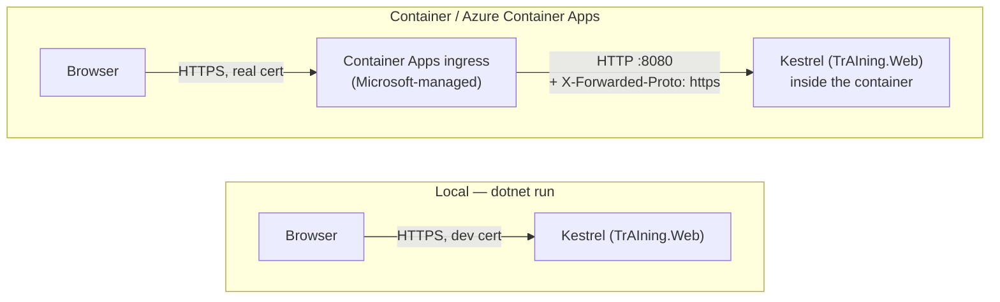

# TLS termination: local vs. container/Azure

Where HTTPS actually happens is different locally than it is once the app runs in a container —
this trips people up because both "just work" without you configuring anything, for different
reasons. Kestrel is the .NET web server built into the app in both cases; what differs is who's
in front of it.

## Local (`dotnet run`)

One hop. Kestrel itself holds a certificate (the local "dev cert" installed via
`dotnet dev-certs https --trust`) and terminates TLS in-process — it does the real handshake,
decrypts the traffic itself. `Request.IsHttps` is simply true, correctly, with no help needed.

## Container / Azure Container Apps

Two hops, not one:

1. **Browser → Container Apps ingress** — real HTTPS, a real publicly-trusted certificate,
   genuinely encrypted. This is the connection the outside world sees.
2. **Ingress → the container (Kestrel)** — plain HTTP, over Azure's private internal network,
   never touching the public internet. The ingress decrypts the browser's traffic, then re-sends
   it to the container unencrypted internally, on the port set by the Dockerfile's
   `ASPNETCORE_HTTP_PORTS=8080`.

This isn't a shortcut — managing a real TLS certificate (provisioning, renewal, key security)
inside every container instance is exactly the operational burden a managed ingress exists to
remove. It's how essentially every cloud load balancer/reverse proxy works, not something
specific to us.

**The catch:** by the time a request reaches Kestrel in the container, it genuinely *is* plain
HTTP (hop 2) — Kestrel has no way to know hop 1 was encrypted. Left alone, that makes
`UseHttpsRedirection()` in `Program.cs` try to redirect an already-secure request and fail to
find an HTTPS port to send it to (the `Failed to determine the https port for redirect` warning
you only see running the container, never via `dotnet run`).

The fix, already in `Program.cs`: the ingress adds an `X-Forwarded-Proto: https` header to every
request it forwards — "FYI, this arrived over HTTPS before I decrypted it." The
`UseForwardedHeaders` middleware reads that header and overwrites `Request.Scheme` accordingly,
so the rest of the pipeline correctly treats the request as HTTPS even though the literal socket
connection to Kestrel was plain HTTP. `UseHttpsRedirection()` then sees an already-HTTPS request
and does nothing.

That middleware also clears `KnownIPNetworks`/`KnownProxies` — ASP.NET Core normally only trusts
`X-Forwarded-Proto` from a proxy on `localhost`, to stop random internet traffic from forging
"trust me, I was HTTPS." That's safe to relax here specifically because the ingress is the
*only* way to reach the container at all — there's no direct public path to port 8080 that
bypasses it, so nothing is left that could forge the header.
