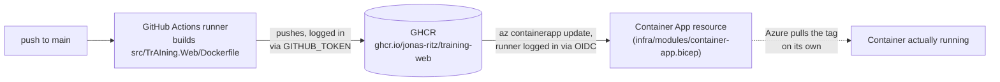

# Deploy

TrAIning.Web deploys itself. `.github/workflows/ci.yml` triggers automatically on every push to
`main` (`on: push: branches: [main]`) and runs two jobs, in order:



Who does what, concretely:

- **`build-and-push` job**: the runner — a temporary VM GitHub provisions for this one run —
  builds the image from `src/TrAIning.Web/Dockerfile` (`docker/build-push-action`), then pushes it
  itself to GHCR, tagged with the commit's short SHA. Logged in to GHCR as the workflow, via its
  own short-lived `GITHUB_TOKEN` — no PAT. The package is public, so nothing downstream needs a
  credential to pull it.
- **`deploy` job**: the same kind of runner logs in to **Azure** via OIDC (ADR-0012) — no stored
  secret, a federated credential trusts GitHub's token only for pushes to `main` on this exact
  repo. It runs `az containerapp update --image ...`, which only edits the Container App resource
  (`infra/modules/container-app.bicep`) to point at the new tag.

That last step is the one easy to misread: the runner does not hand the image to Azure. It only
changes *which tag* the Container App resource references. Azure's own infrastructure then fetches
that image from GHCR itself, independently, whenever it needs to start a replica — the runner
never transfers the image bytes anywhere near Azure.

The two jobs are connected by an explicit dependency, not just file order: `deploy` declares
`needs: build-and-push`, which does two things — it waits for that job to finish, and it lets
`deploy` read `needs.build-and-push.outputs.sha`, the exact tag that job just pushed. Without that
link, `deploy` would have no reliable way to know which tag is actually new.

## What's actually running

`infra/main.bicep`: a Log Analytics workspace (`log-training`), a Container Apps Environment
(`cae-training`), and the Container App itself (`ca-training-web`, external ingress on port 8080,
scale-to-zero — `infra/modules/container-app.bicep`). Not there yet, deliberately: Azure SQL /
Blob / Key Vault — nothing reads or writes to them yet.

## One-time setup (already done; only needed again from scratch)

- **Infra bootstrap** — create the resource group, then `az deployment group create -g rg-training
  -f infra/main.bicep --parameters webImage=<any-existing-tag>`. Region matters: not every
  subscription can create resources in every region (West Europe rejected this one); `az
  deployment group what-if` with a different `--parameters location=` is the fast way to check.
- **Making the GHCR package public** — the first push to a new GHCR package defaults to private.
  github.com/jonas-ritz?tab=packages → `training-web` → Package settings → Change visibility →
  Public. Without this, Azure's pull fails even though the push itself succeeded.
- **Letting GitHub Actions deploy** — the OIDC app registration, federated credential, and role
  assignment. See [github-actions-oidc.md](github-actions-oidc.md) (includes a CLI bug workaround
  worth knowing about if you ever redo this).

## Manual build/deploy (debugging only — CI/CD handles this normally)

```bash
docker build -f src/TrAIning.Web/Dockerfile -t ghcr.io/jonas-ritz/training-web:<tag> .
docker push ghcr.io/jonas-ritz/training-web:<tag>   # requires docker login ghcr.io first
az containerapp update -g rg-training -n ca-training-web --image ghcr.io/jonas-ritz/training-web:<tag>
```

## Verify

```bash
az resource list -g rg-training -o table                                          # all Succeeded?
az containerapp show -g rg-training -n ca-training-web \
  --query "properties.template.containers[0].image" -o tsv                        # which tag is live
curl -I https://<app-fqdn>                                                        # actually reachable?
az containerapp logs show -g rg-training -n ca-training-web --tail 30             # what the app itself is logging
```

The FQDN is a deployment output: `az deployment group show -g rg-training -n main --query
properties.outputs.webFqdn.value -o tsv`.

## Secrets

The Log Analytics workspace's access key (`listKeys().primarySharedKey`) is marked `@secure()` on
both the output and the parameter that carries it, so it never appears in plaintext deployment
history. Nothing else in this template is a secret — there's no Key Vault yet.
