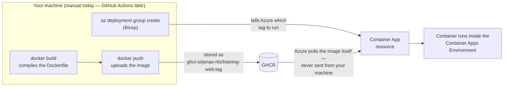

# Deploy

How the Azure infrastructure gets created and updated. For now this is a manual, one-time
bootstrap (Bicep from your own machine); a GitHub Actions workflow will later automate the
update path, but the first-time setup below stays manual either way.

## What's in `infra/` today, and what isn't

`infra/main.bicep` defines:

- A Log Analytics workspace (`log-training`) — where every container's logs end up.
- A Container Apps Environment (`cae-training`) — the shared host that Container Apps and
  Container App Jobs run inside.
- A Container App (`ca-training-web`) — runs `TrAIning.Web`, pulling a pre-built image from GHCR.

**Not here, deliberately:** Azure SQL / Blob Storage / Key Vault. Nothing in the codebase reads
or writes to them yet — provisioning them earlier than the code that needs them just adds cost
and drift risk for no benefit. See spec.md §12 for the phase they're each introduced in.

## How the image actually gets from your machine to Azure

Bicep never touches the image itself — `az deployment group create` only tells the Container App
resource *which image tag to run*. The image has to already exist somewhere Azure can reach
before that command can succeed:



Three separate things, easy to conflate into one "deploy" step:

1. **Build** — compiles the Dockerfile into an image, entirely local to whatever machine runs it.
2. **Push** — uploads that image to GHCR, a storage location independent of both your machine and
   Azure. This is the only step in this whole flow that needs a GitHub credential.
3. **Deploy** — `az deployment group create` updates the Container App resource's `image`
   property to point at a tag in GHCR. Azure's own infrastructure then pulls that image from GHCR
   on its own, using the credentials/permissions configured earlier — nothing is transferred
   *from* your machine *to* Azure directly. If step 2 hasn't happened yet, or the tag is wrong,
   step 3 succeeds (the Bicep deployment itself is valid) but the Container App fails to start,
   because Azure can't find the image it was told to pull.

## Prerequisites

1. **Azure CLI**, logged in: `az login` (or `az login --use-device-code` if the normal browser
   flow doesn't work in your environment — it prints a URL and a short code to enter there).
   Confirm you're on the right account/subscription afterwards: `az account show`.
2. **A pay-as-you-go subscription isn't required yet** — everything deployed so far runs on
   free-tier resources regardless of subscription type. See
   [azure-subscription.md](azure-subscription.md) for when that changes (once Foundry is in use).
3. **The resource group must already exist.** Bicep here is scoped to an existing resource group
   on purpose (see `main.bicep`'s top comment) — creating it is a separate, explicit step:
   ```bash
   az group create --name rg-training --location <region>
   ```
   Pick a region Container Apps and (later) Foundry both support. **Not every region accepts new
   resources on every subscription** — newer or free-tier subscriptions can get rejected in
   high-demand regions with `RequestDisallowedByAzure ... currently not accepting new customers`.
   If that happens, `az deployment group what-if` (below) with a different `location` override is
   a fast way to check which regions your subscription actually has access to before committing.

## Build and push the image

4. **Log in to GHCR**, once: `docker login ghcr.io -u <your-github-username>`, password = a
   Personal Access Token (classic) with the `write:packages` scope
   (github.com → Settings → Developer settings → Personal access tokens → Tokens (classic)).
5. **Build, tag, and push:**
   ```bash
   docker build -f src/TrAIning.Web/Dockerfile -t ghcr.io/jonas-ritz/training-web:<tag> .
   docker push ghcr.io/jonas-ritz/training-web:<tag>
   ```
   `<tag>` can be anything unique — a git short SHA (`git rev-parse --short HEAD`) is a reasonable
   default and matches what CI tags with later.
6. **The GHCR package must be public** for Azure to pull it without any registry credentials
   configured in Bicep — first push creates the package as private by default, so after the very
   first push: github.com/jonas-ritz?tab=packages → the `training-web` package → Package settings
   → Change visibility → Public. Only needed once; later pushes to the same package stay public.

## Deploy

```bash
az deployment group create -g rg-training -f infra/main.bicep --parameters webImage=ghcr.io/jonas-ritz/training-web:<tag>
```

Bicep resources default their region to the resource group's own region
(`resourceGroup().location` in `main.bicep`), so as long as the resource group is where you want
things, no extra flags are needed for that. `webImage` has no default — it must always be passed
explicitly, so a deploy can never silently run a stale/wrong tag.

**Preview first, if you want to see the diff before it applies:**

```bash
az deployment group what-if -g rg-training -f infra/main.bicep --parameters webImage=ghcr.io/jonas-ritz/training-web:<tag>
```

`what-if` shows exactly what would be created/changed/deleted without touching anything. Secret
outputs (see below) show as `*******` even here, not just in the final result. Ignore any
`Modify` noise on `cae-training` for properties like `workloadProfiles` or `peerAuthentication` —
those are Azure-populated defaults our template never sets, so redeploying is a no-op for them
even though `what-if` shows them as changing.

## Verify

```bash
az resource list -g rg-training -o table
```

Should show `log-training`, `cae-training`, and `ca-training-web`, all `Succeeded`. Same
information the Azure Portal shows under the resource group's Overview page, if you'd rather look
there. To confirm the app is actually reachable, not just that the resource exists:

```bash
curl -I "https://$(az deployment group show -g rg-training -n main --query properties.outputs.webFqdn.value -o tsv)"
```

Should return `200`.

## A note on secrets in this template

The Log Analytics workspace exposes an access key (`listKeys().primarySharedKey`) that the
Container Apps Environment needs, to authenticate its log writes. That value is marked
`@secure()` on both the output that produces it and the parameter that receives it — Azure then
omits it from the plaintext deployment-history/outputs view, rather than leaving a credential
sitting in cleartext for anyone who can read deployment history. No secret in this template comes
from Key Vault (there isn't one yet) or from a `.env`/config file — it's generated and consumed
entirely within the deployment itself.
